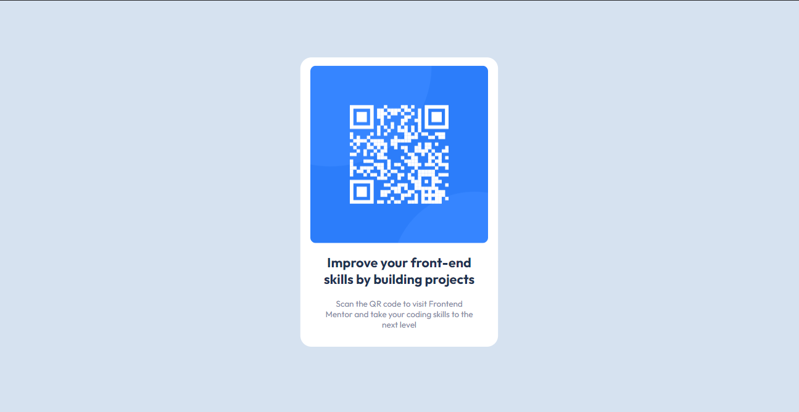
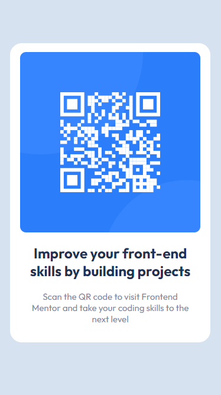

# Frontend Mentor - QR code component solution

This is a solution to the [QR code component challenge on Frontend Mentor](https://www.frontendmentor.io/challenges/qr-code-component-iux_sIO_H). Frontend Mentor challenges help you improve your coding skills by building realistic projects.

## Table of contents

- [Overview](#overview)
  - [Screenshot](#screenshot)
  - [Links](#links)
- [My process](#my-process)
  - [Built with](#built-with)
  - [What I learned](#what-i-learned)
  - [Continued development](#continued-development)
  - [Useful resources](#useful-resources)
- [Author](#author)
- [Acknowledgments](#acknowledgments)

**Note: Delete this note and update the table of contents based on what sections you keep.**

## Overview

### Screenshot





### Links

- Solution URL: [QR Code Component solution]([https://your-solution-url.com](https://www.frontendmentor.io/solutions/mobilefirst-approach-qr-code-component-uZzXUtKWKZ))
- Live Site URL: [Solution Live Site]([https://your-live-site-url.com](https://triii3.github.io/mobile-first-qr-code/))

## My process

### Built with

- Semantic HTML5 markup
- CSS3
- Flexbox
- Mobile-first workflow

### What I learned

Use this section to recap over some of your major learnings while working through this project. Writing these out and providing code samples of areas you want to highlight is a great way to reinforce your own knowledge.

To see how you can add code snippets, see below:

```html
<link rel="stylesheet" href="index_style.css" />
<link rel="preconnect" href="https://fonts.googleapis.com" />
<link rel="preconnect" href="https://fonts.gstatic.com" crossorigin />
<link
  href="https://fonts.googleapis.com/css2?family=Outfit:wght@400;700&display=swap"
  rel="stylesheet"
/>
<!-- I never knew there was this method of adding font families from 'font.google.com' -->
```

```css
body {
  height: 100vh;
  /* set to 100 viewing height of the device to help the elements find the center using the attributes: 'justify-contents: center;' and 'align-items: center;' */
}
```

### Continued development

I'd like to focus more on how to get the correct dimensions/width/height of an element. Finding the correct measurements to properly replicate the designs as close as possible while following the standard way of coding HTML and CSS.

### Useful resources

- [Centering a div](https://blog.hubspot.com/website/center-div-css) - This helped me understand the different methods of centering a div.

- [Responsive Website](https://www.w3schools.com/html/html_responsive.asp) - This is one of the articles that guided me through creating a web page that would look good on any target devices.

## Author

- GitHub Profile - [Triii](https://github.com/Triii3)
- Frontend Mentor - [@Triii3](https://www.frontendmentor.io/profile/Triii3)
- Twitter - [@TriiiCodes](https://twitter.com/TriiiCodes)

